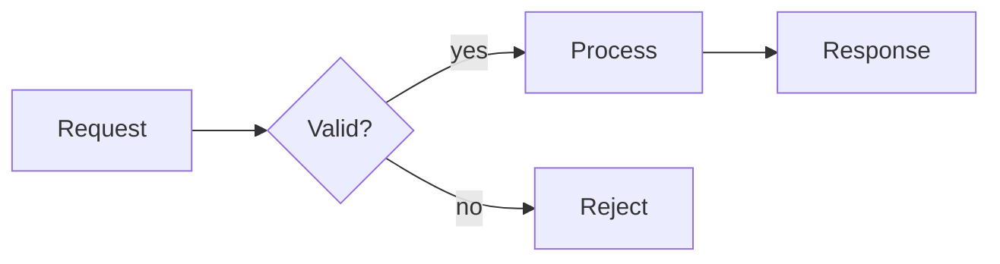
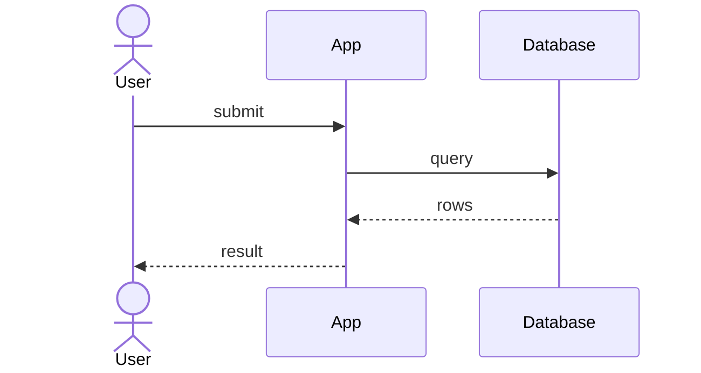
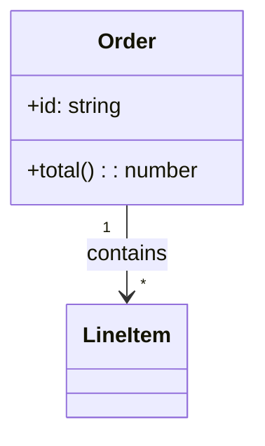
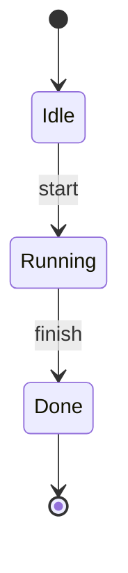
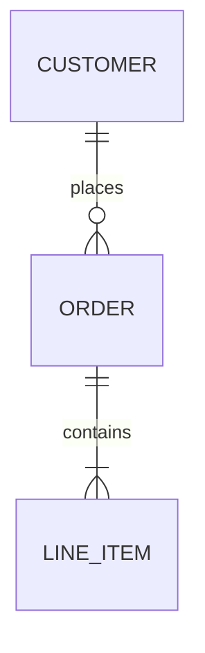
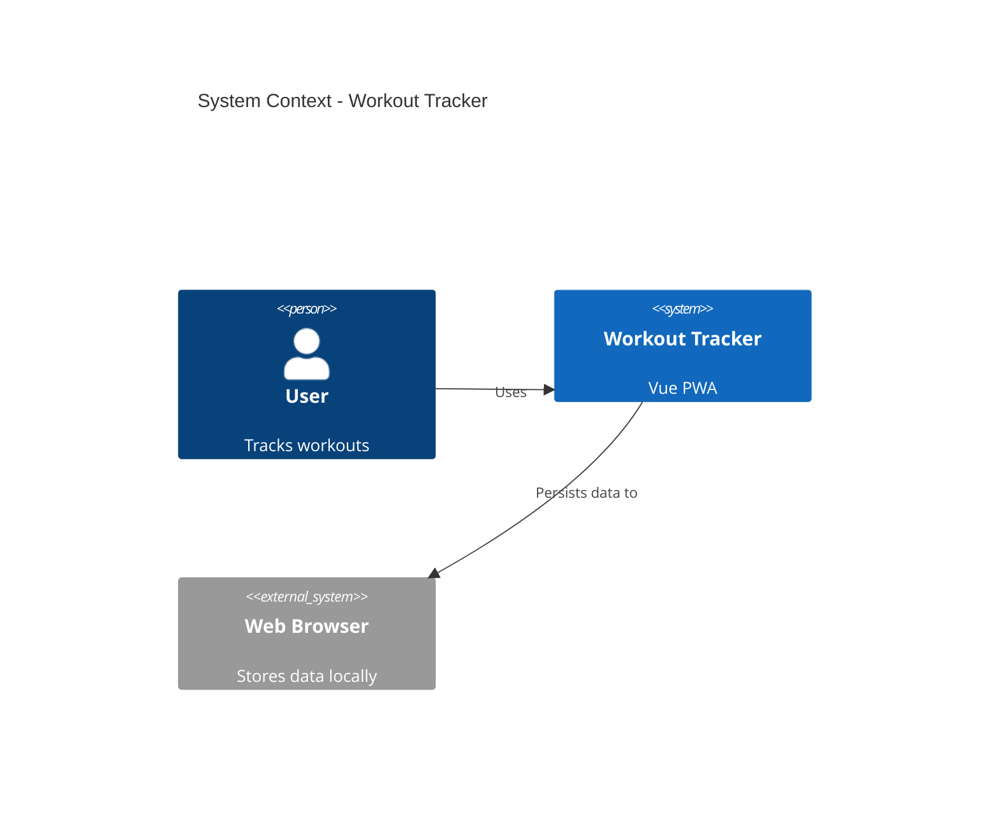
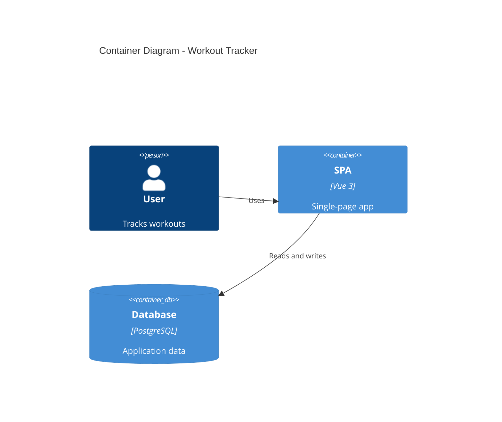

# technical-diagrams

Produce technical diagrams that a reader with little domain background can understand. This skill is a shared foundation: other skills reference it by name when they decide a diagram would reduce confusion more than prose would.

## Invocation

This skill is explicit-only and is normally reached through another skill, not started directly. It has no separate slash command of its own.

## Output format

- Default to a Mermaid code block embedded in the surrounding Markdown:

  ````markdown
  ```mermaid
  flowchart LR
    A[Start] --> B[End]
  ```
  ````

- Keep `assets/` for original source images and screenshots only. Do not dump Mermaid source into `assets/`.
- Do not require a renderer, Mermaid CLI, or external editor. The diagram is plain text that GitHub, VS Code, and many Markdown viewers render directly.
- If the reader's target viewer cannot render Mermaid, note that once, then continue; do not silently replace the diagram with prose.

## Style rules

- Draw the smallest diagram that makes the idea clear. If prose already explains it, do not add a diagram.
- Use plain, short labels. Write labels in the conversation language.
- Keep each diagram under about 10 nodes. Split a complex system into separate focused diagrams instead of one tangled map.
- A diagram must be explained in the surrounding prose. Never drop in a bare diagram.
- Prefer left-to-right (`LR`) for flows and top-to-bottom (`TD`) for hierarchies.

## Diagram types and minimal syntax

### Flowchart

Use for processes, decisions, and user journeys.



Shapes: `[rectangle]`, `(rounded)`, `{diamond}`, `([stadium])`, `[[subroutine]]`, `((circle))`.

### Sequence diagram

Use for request/response flows and interaction between components.



Arrows: `->>` solid message, `-->>` reply, `-)` async. Use `actor` for people and `participant` for systems.

### Class diagram

Use only when the reader needs to see type relationships, not for every code explanation.



Relationships: `-->` association, `--|>` inheritance, `..>` dependency, `o--` aggregation, `*--` composition.

### State diagram

Use for lifecycles, state machines, and workflows with explicit states.



### ER diagram

Use only for data models, not for casual concept relationships.



Cardinality: `||` exactly one, `o|` zero or one, `}o` zero or many, `}|` one or many.

## C4 architecture views

C4 is a way to describe architecture at four zoom levels. For beginner readers, almost always use only the first two levels.

### Level 1: System Context

Shows the system, its users, and external systems. Always the first architecture diagram.



### Level 2: Container

Shows deployable units such as apps, services, and databases. Add this only for multi-service systems.



Level 3 (Component) and Level 4 (Deployment) are rarely worth the reader's attention. Produce them only when another skill explicitly asks and the audience needs that depth.

### C4 element syntax

- People: `Person`, `Person_Ext`
- Systems: `System`, `System_Ext`, `SystemDb`
- Containers: `Container`, `ContainerDb`, `ContainerQueue`
- Relationships: `Rel(from, to, "label")`; use action verbs like "Reads", "Publishes to", not bare "uses".
- Boundaries: wrap related elements in `System_Boundary` or `Container_Boundary`.

## Rules inherited from this skill's purpose

- One idea per diagram. A context diagram and a container diagram are two different diagrams, not one.
- Every element needs a short description so a beginner knows what it is.
- Prefer unidirectional arrows. Label the arrow with an action.
- Do not invent a "subcomponent" level. C4 levels are context, container, component, and deployment only.

## When not to draw

- When the prose already makes the point.
- When the reader is a beginner and the diagram adds vocabulary they must decode first.
- When the source already has a clear image: keep the original image instead.

## Source attribution

Mermaid syntax and C4 guidance are condensed from the open-source `softaworks/agent-toolkit` skills `mermaid-diagrams` and `c4-architecture` (MIT licensed), then adapted for beginner reading outputs.
