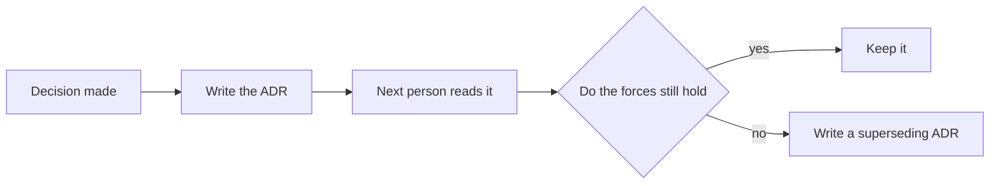

<!-- A minimal example of quick-tier output, abridged for the skill assets.
     A real session carries the full section list from references/output-schemas.md. -->

---
goal_card:
  topic: "Architecture Decision Records (ADR)"
  scope: "What ADRs are, why they exist, and how to start. No tool-by-tool comparison."
  purpose: understand
  tier: quick
  time_budget: "10 minutes"
  starting_point: "Software engineer, no prior ADR exposure"
  output_shape: single-file
  language: en
  self_test: false
  illustrations: true
  source_scope: self-research+user-provided
---

# Architecture Decision Records (ADR)

## Goal card

| # | Field | Value |
| --- | --- | --- |
| 1 | Topic | Architecture Decision Records (ADR) |
| 2 | Scope | What ADRs are, why they exist, how to start |
| 3 | Purpose | understand |
| 4 | Depth tier | quick |
| 5 | Time budget | about 10 minutes |
| 6 | Starting point | software engineer, no prior ADR exposure |
| 7 | Output shape | single file |
| 8 | Language | English |
| 9 | Self-test | off |
| 10 | Illustrations | on |
| 11 | Source scope | self-research + user-provided |

## The answer in one sentence

An ADR is a short document that records one architecturally significant decision, the forces behind it, and its consequences, so the next person does not have to guess why the system looks the way it does.

## What it is and why it exists

Nygard defined the practice in 2011 around a specific failure mode: the reasoning behind a decision is the first thing a project loses. Large documents are never kept up to date and nobody reads them, so the decision survives while its motivation disappears. New team members then either accept decisions they do not understand or change them without knowing what the decision was protecting ([Nygard, 2011](https://cognitect.com/blog/2011/11/15/documenting-architecture-decisions)).

Microsoft's architecture guidance puts the same point in one line: the architecture is the accumulation of its decisions, and the ADR is the record of how and why the system reached its current shape ([Microsoft Learn, 2026](https://learn.microsoft.com/en-us/azure/well-architected/architect-role/architecture-decision-record)).

## Minimum vocabulary

- **Architecture decision (AD)**: a justified design choice that answers an architecturally significant requirement ([adr.github.io](https://adr.github.io/)).
- **Architecturally significant requirement (ASR)**: a requirement with a measurable effect on architecture and quality attributes.
- **Decision log**: all the ADRs of a project taken together.
- **Superseded**: a record's status once a newer ADR replaces it; the old record stays.

## The main line

1. Decisions happen whether or not anyone records them; the reasoning does not survive on its own.
2. Small, modular records get maintained; large documents do not.
3. One decision, one record: Context, Decision, Status, Consequences, one to two pages.
4. Keep the records in version control, next to the code, so they evolve together ([ThoughtWorks, 2018](https://www.thoughtworks.com/radar/techniques/lightweight-architecture-decision-records)).
5. Accepted records are not edited. Write a new record that supersedes the old one and link the two ([Microsoft Learn, 2026](https://learn.microsoft.com/en-us/azure/well-architected/architect-role/architecture-decision-record)).

The diagram is the whole lifecycle: a decision leaves a record, the next person reads the record before judging the decision, and a changed context produces a new record instead of a quiet edit.

## One concrete example

An order service must decide how it talks to inventory:

- **Context**: peak traffic is high and inventory occasionally times out; the team worries about cascading failures.
- **Decision**: use asynchronous events between the two services.
- **Status**: accepted.
- **Consequences**: order writes no longer fail when inventory is slow; inventory becomes eventually consistent, and the UI needs a pending state.

The value is not the conclusion. It is that the forces and the accepted trade-offs stay attached to it.

## Common misreadings

- Treating an ADR as a full design document; it records one decision, in one or two pages.
- Believing accepted records are frozen forever; they are superseded, not rewritten.
- Writing ADRs only at project start; decisions arrive throughout a project's life.
- Recording conclusions without context, which makes the record useless the moment circumstances change.

## Sources

| Title | Author or organization | Type | Tier | Link | Accessed |
| --- | --- | --- | --- | --- | --- |
| Documenting Architecture Decisions | Michael Nygard | Origin article | S | https://cognitect.com/blog/2011/11/15/documenting-architecture-decisions | 2026-09-11 |
| Architectural Decision Records | adr.github.io | Community organization | A | https://adr.github.io/ | 2026-09-11 |
| Maintain an architecture decision record (ADR) | Microsoft Learn | Official guidance | A | https://learn.microsoft.com/en-us/azure/well-architected/architect-role/architecture-decision-record | 2026-09-11 |
| Lightweight Architecture Decision Records | ThoughtWorks | Technology Radar | A | https://www.thoughtworks.com/radar/techniques/lightweight-architecture-decision-records | 2026-09-11 |
